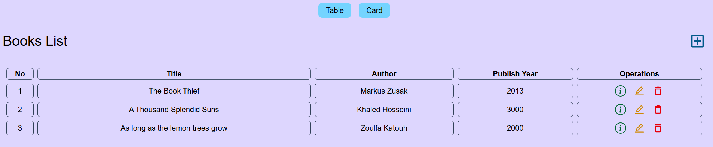
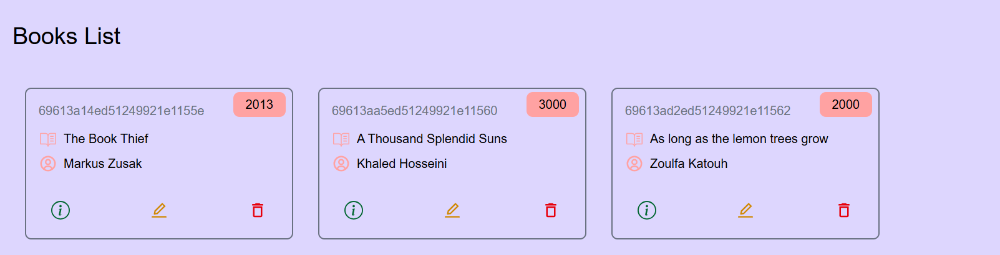
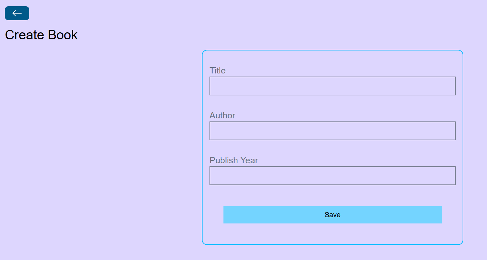
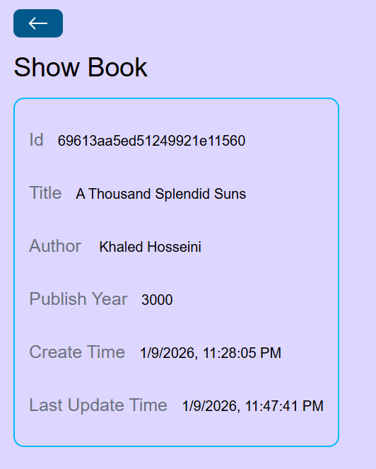

# Book Management App

## Description
This is a full-stack book management application that allows users to create, read, update, and delete books. The app features a modern, colorful UI with card and table views, built with React on the frontend and Node.js/Express on the backend.

## Tech Stack
- **Frontend**: React, Vite, Tailwind CSS, React Router
- **Backend**: Node.js, Express.js, MongoDB, Mongoose
- **Icons**: React Icons

## Features
- View books in card or table format
- Add new books with title, author, and publish year
- Edit existing books
- Delete books with confirmation
- View detailed book information including timestamps
- Responsive design with modern UI
- Gradient backgrounds and glassmorphism effects
- Smooth animations and hover effects

## Architecture
- **Frontend**: Single-page application with React Router for navigation
- **Backend**: RESTful API with Express.js serving CRUD operations
- **Database**: MongoDB with Mongoose ODM for data modeling
- **Styling**: Tailwind CSS with custom CSS for enhanced visual appeal

## Installation

### Prerequisites
- Node.js installed
- MongoDB running locally or connection string

### Backend Setup
1. Navigate to the `backend` directory
2. Run `npm install` to install dependencies
3. Configure MongoDB connection in `config.js`
4. Run `npm start` to start the server on port 5000

### Frontend Setup
1. Navigate to the `frontend` directory
2. Run `npm install` to install dependencies
3. Run `npm run dev` to start the development server on port 5173

## Usage
1. Start both backend and frontend servers
2. Open your browser and navigate to `http://localhost:5173`
3. Use the "Table" and "Card" buttons to switch between views
4. Click the "+" icon to add a new book
5. Click on book cards or table rows to view details
6. Use the edit (pencil) and delete (trash) icons to modify or remove books
7. Navigate back using the back button on detail pages

## Components Overview
- **Home**: Main page displaying books with view toggle
- **BooksCard**: Grid layout for card view
- **BookSingleCard**: Individual book card component
- **BooksTable**: Table layout for list view
- **CreateBook**: Form to add new books
- **ShowBook**: Detailed book information page
- **EditBook**: Form to edit existing books
- **DeleteBook**: Confirmation page for deletion
- **Spinner**: Loading indicator
- **BackButton**: Navigation component

## Database Schema
Books collection with fields:
- `_id`: MongoDB ObjectId
- `title`: String (required)
- `author`: String (required)
- `publishYear`: Number (required)
- `createdAt`: Timestamp
- `updatedAt`: Timestamp

## Error Handling
- Frontend handles API errors gracefully
- Backend validates required fields
- 404 responses for non-existent books
- Loading states during API calls

## Development Notes
- CORS enabled for frontend-backend communication
- Environment variables for MongoDB connection
- Hot reload enabled in development mode
- ESLint for code quality

## Project Screenshots

## Things I try to do in this project
Backend CRUD
Backend Router
CORS Policy
MongoDB operations
Frontend CRUD 
Frontend Router 